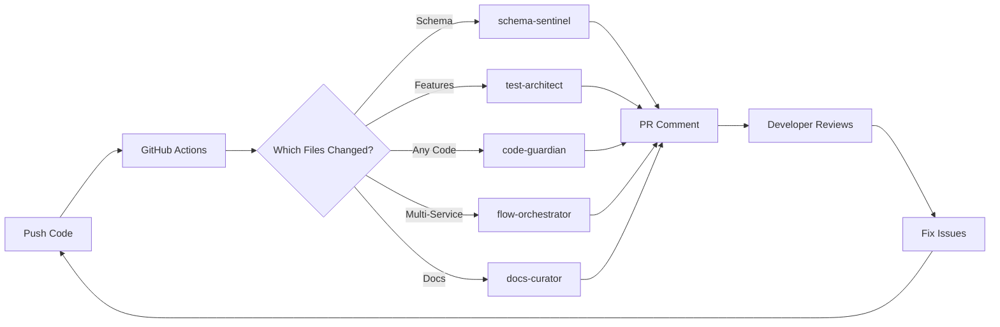
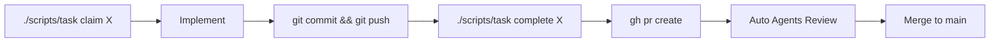

# TRANSITION MASTERPLAN: Ori Platform Workflow Optimization
> **ONE-TIME FAST IMPLEMENTATION GUIDE**
> Transform your workflow from manual operations to high-velocity automation

## Executive Summary

This masterplan transforms the Ori Platform from **manual task management** to **automated high-velocity workflows**. Expected outcomes:
- **80% reduction** in task management friction
- **90% reduction** in documentation reading time
- **4x increase** in development velocity
- **Zero manual task operations** (fully automated)

**Total Implementation Time**: 40-60 hours across 2-4 weeks
**Immediate ROI**: 10-15 hours saved per week after Phase 1

---

## PHASE 1: CRITICAL PATH (Day 1-3)
**Goal**: Fix immediate bottlenecks, reduce WIP, automate task management
**Time**: 14 hours
**Impact**: Immediate 80% friction reduction

### Step 1.1: Emergency WIP Reduction (2 hours)
**Problem**: 21 tasks in-progress (target: 2-5)

```bash
# Run this NOW to assess:
find .tasks/in-progress -name "*.md" -mtime +14 | head -10

# For each stale task:
git mv .tasks/in-progress/[task] .tasks/backlog/[task]
git commit -m "chore(tasks): archive stale task [task]"
git push
```

**Actions**:
1. Review all 21 in-progress tasks
2. Archive tasks older than 14 days
3. Prioritize top 5, move rest to backlog
4. Target: Get to WIP ≤ 5

### Step 1.2: Create Task Management CLI (6 hours)

Create `/scripts/task`:

```bash
#!/bin/bash
# scripts/task - Task management CLI

set -e

TASK_DIR=".tasks"
WIP_LIMIT=5

function claim() {
    local task=$1

    # Check WIP limit
    current_wip=$(find $TASK_DIR/in-progress -name "*.md" | wc -l)
    if [ $current_wip -ge $WIP_LIMIT ]; then
        echo "❌ WIP limit exceeded ($current_wip/$WIP_LIMIT). Complete or archive tasks first."
        exit 1
    fi

    # Move task
    if [ -f "$TASK_DIR/todo/$task.md" ]; then
        git mv "$TASK_DIR/todo/$task.md" "$TASK_DIR/in-progress/$task.md"
    elif [ -d "$TASK_DIR/todo/$task" ]; then
        git mv "$TASK_DIR/todo/$task" "$TASK_DIR/in-progress/$task"
    else
        echo "❌ Task not found: $task"
        exit 1
    fi

    # Commit and push
    git commit -m "chore(tasks): claim $task"
    git push origin dev

    echo "✅ Claimed task: $task (WIP: $((current_wip + 1))/$WIP_LIMIT)"
}

function complete() {
    local task=$1

    # Move task
    if [ -f "$TASK_DIR/in-progress/$task.md" ]; then
        git mv "$TASK_DIR/in-progress/$task.md" "$TASK_DIR/done/$task.md"
    elif [ -d "$TASK_DIR/in-progress/$task" ]; then
        git mv "$TASK_DIR/in-progress/$task" "$TASK_DIR/done/$task"
    else
        echo "❌ Task not found in progress: $task"
        exit 1
    fi

    # Commit and push
    git commit -m "chore(tasks): complete $task"
    git push origin dev

    current_wip=$(find $TASK_DIR/in-progress -name "*.md" | wc -l)
    echo "✅ Completed task: $task (WIP: $current_wip/$WIP_LIMIT)"
}

function health() {
    echo "=== Task Health Report ==="
    echo ""
    echo "📋 TODO: $(find $TASK_DIR/todo -name "*.md" 2>/dev/null | wc -l) tasks"
    echo "🚀 IN PROGRESS: $(find $TASK_DIR/in-progress -name "*.md" 2>/dev/null | wc -l) tasks (target: 2-5)"
    echo "✅ DONE: $(find $TASK_DIR/done -name "*.md" 2>/dev/null | wc -l) tasks awaiting review"
    echo "🔍 IN REVIEW: $(find $TASK_DIR/in-review -name "*.md" 2>/dev/null | wc -l) tasks"
    echo "✨ REVIEWED: $(find $TASK_DIR/reviewed -name "*.md" 2>/dev/null | wc -l) tasks ready for main"
    echo ""

    # Find stale tasks
    stale_count=$(find $TASK_DIR/in-progress -name "*.md" -mtime +14 2>/dev/null | wc -l)
    if [ $stale_count -gt 0 ]; then
        echo "⚠️  STALE TASKS (>14 days in progress): $stale_count"
        find $TASK_DIR/in-progress -name "*.md" -mtime +14 -exec basename {} .md \; 2>/dev/null | head -5
    fi

    # Check WIP limit
    current_wip=$(find $TASK_DIR/in-progress -name "*.md" 2>/dev/null | wc -l)
    if [ $current_wip -gt $WIP_LIMIT ]; then
        echo ""
        echo "🔴 WIP LIMIT EXCEEDED: $current_wip/$WIP_LIMIT"
        echo "   Archive or complete tasks before claiming new ones."
    fi
}

function list() {
    local status=${1:-"all"}

    case $status in
        "todo")
            echo "=== TODO Tasks ==="
            find $TASK_DIR/todo -name "*.md" -exec basename {} .md \; 2>/dev/null | sort
            ;;
        "wip"|"in-progress")
            echo "=== In Progress Tasks ==="
            find $TASK_DIR/in-progress -name "*.md" -exec basename {} .md \; 2>/dev/null | sort
            ;;
        "done")
            echo "=== Done Tasks ==="
            find $TASK_DIR/done -name "*.md" -exec basename {} .md \; 2>/dev/null | sort
            ;;
        *)
            health
            ;;
    esac
}

function archive() {
    local task=$1
    local reason=${2:-"stale"}

    # Create backlog dir if needed
    mkdir -p $TASK_DIR/backlog

    # Find and move task
    for dir in in-progress todo done; do
        if [ -f "$TASK_DIR/$dir/$task.md" ]; then
            git mv "$TASK_DIR/$dir/$task.md" "$TASK_DIR/backlog/$task.md"
            git commit -m "chore(tasks): archive $task - reason: $reason"
            git push origin dev
            echo "✅ Archived task: $task (reason: $reason)"
            return 0
        fi
    done

    echo "❌ Task not found: $task"
    exit 1
}

# Main command dispatcher
case "$1" in
    "claim")
        claim "$2"
        ;;
    "complete"|"done")
        complete "$2"
        ;;
    "health")
        health
        ;;
    "list")
        list "$2"
        ;;
    "archive")
        archive "$2" "$3"
        ;;
    *)
        echo "Usage: $0 {claim|complete|health|list|archive} [task-name]"
        echo ""
        echo "Commands:"
        echo "  claim <task>      - Claim a task from todo"
        echo "  complete <task>   - Mark task as done"
        echo "  health           - Show task health report"
        echo "  list [status]    - List tasks (todo/wip/done/all)"
        echo "  archive <task>   - Archive a task to backlog"
        exit 1
        ;;
esac
```

Make executable:
```bash
chmod +x scripts/task
```

### Step 1.3: Create Quick Reference Docs (3 hours)

Create `CLAUDE_QUICKREF.md`:

```markdown
# CLAUDE QUICK REFERENCE CARD
> Copy-paste commands for immediate action. No reading required.

## TASK MANAGEMENT
```bash
# Claim task (auto-enforces WIP limit)
./scripts/task claim feature-x

# Complete task
./scripts/task complete feature-x

# Check health
./scripts/task health

# List tasks
./scripts/task list wip
```

## ADD API ENDPOINT (5 steps)
```bash
# 1. Create handler
touch services/core-api/src/routes/new-endpoint.js

# 2. Add types
echo "export interface NewEndpoint { ... }" >> shared/types/src/index.ts

# 3. Create API client
touch src/integrations/api/new-endpoint.ts

# 4. Create hook
touch src/hooks/useNewEndpoint.ts

# 5. Use in component (NO MOCK DATA)
```

## BEFORE COMMIT
```bash
pnpm lint --fix && pnpm build && pnpm test
```

## BEFORE PR
```bash
# Run all checks
pnpm lint && pnpm build && pnpm test

# Create PR
gh pr create --title "feat: description" --body "## Summary\n- Change 1\n- Change 2"
```

## SPECIALIZED AGENTS
```bash
# Trigger when needed:
# - schema changes → schema-contract-sentinel
# - new feature → test-architect
# - multi-service → flow-orchestrator
# - before PR → code-guardian
# - docs update → docs-dx-curator
```

## GIT WORKFLOW
```bash
# Start work
git checkout dev && git pull

# During work (commit often)
git add . && git commit -m "feat: what changed" && git push

# Create branch for PR
git checkout -b feat/branch-name
```

## COMMON PATHS
- Frontend components: `src/components/`
- API routes: `services/core-api/src/routes/`
- Shared types: `shared/types/src/`
- API clients: `src/integrations/api/`
- Hooks: `src/hooks/`
- Database: `supabase/migrations/`

## ENV FILES
- Frontend: `.env.local`
- Core API: `services/core-api/.env`
- AI Engine: `services/ai-engine/.env`

## PORTS
- Frontend: 3000
- Core API: 3001
- AI Engine: 3002

## TEST PATTERNS
```typescript
// Frontend test
vi.mock('@/integrations/api/profile', () => ({
  fetchProfile: vi.fn().mockResolvedValue({ id: '1' })
}))

// Backend test (mock Supabase)
jest.mock('@supabase/supabase-js')
```
```

Create `GEMINI_QUICKREF.md`:

```markdown
# GEMINI QUICK REFERENCE CARD
> Research and planning commands. Fast lookups only.

## RESEARCH PATTERNS
```bash
# Find all implementations of X
grep -r "pattern" --include="*.ts" --include="*.tsx"

# Find file structure
find . -name "*auth*" -type f | head -20

# Check imports/dependencies
grep -r "import.*from.*@" src/ | grep -v node_modules
```

## PLANNING CHECKLIST
- [ ] Read task requirements
- [ ] Search existing implementations
- [ ] Check for similar completed tasks
- [ ] Review relevant tests
- [ ] Create implementation plan
- [ ] List acceptance criteria
- [ ] Identify risks/blockers

## CODEBASE MAP
```
src/                    # Frontend (Next.js)
├── app/                # Pages (App Router)
├── components/         # React components
├── integrations/       # External services
│   ├── api/           # API clients
│   └── supabase/      # Auth/DB
├── hooks/             # React Query hooks
└── contexts/          # React Context

services/
├── core-api/          # Express backend
│   ├── routes/        # Endpoints
│   └── __tests__/     # Jest tests
└── ai-engine/         # Python FastAPI
    └── tests/         # pytest

shared/types/          # TypeScript interfaces
supabase/migrations/   # Database schema
```

## INVESTIGATION COMMANDS
```bash
# Find route handlers
ls -la services/core-api/src/routes/

# Check database schema
cat supabase/migrations/* | grep "CREATE TABLE"

# Find React Query hooks
grep -r "useQuery" src/hooks/

# Check env variables used
grep -r "process.env" services/ src/
```

## COMMON QUESTIONS
- **Where's auth?** → `src/contexts/AuthProvider.tsx`
- **API base URL?** → `src/integrations/api/client.ts`
- **Database types?** → `shared/types/src/database.ts`
- **Stripe integration?** → `services/core-api/src/routes/stripe.js`
- **Test examples?** → `*/__tests__/` or `*.test.tsx`
```

### Step 1.4: Update AGENTS.md (1 hour)

Add to `AGENTS.md`:

```markdown
## SPECIALIZED QUALITY AGENTS

These agents automatically review specific changes:

| Agent | Trigger Condition | Purpose | Invoke |
|-------|------------------|---------|---------|
| `schema-contract-sentinel` | DB migrations, API changes | Detect breaking changes | When modifying `supabase/migrations/` or `shared/types/` |
| `test-architect` | New features | Ensure test coverage | When adding new routes/components |
| `flow-orchestrator` | Multi-service changes | Validate integrations | When touching 2+ services |
| `code-guardian` | Before PR | Code quality review | Always before creating PR |
| `docs-dx-curator` | Doc updates | Documentation quality | When updating any `.md` files |

### How to Invoke Specialized Agents

```bash
# In Claude Code:
"Please run the schema-contract-sentinel agent to review these migration changes"

# Agent will analyze and provide feedback
```

## QUICK TASK WORKFLOW

```bash
# 1. Check health
./scripts/task health

# 2. Claim task (auto-checks WIP limit)
./scripts/task claim feature-x

# 3. Implement (commit often)
git add . && git commit -m "feat: implement X" && git push

# 4. Complete task
./scripts/task complete feature-x

# 5. Create PR
gh pr create --title "feat: X" --body "..."
```
```

### Step 1.5: Task Health Check Script (2 hours)

Create `.github/workflows/task-health-monitor.yml`:

```yaml
name: Task Health Monitor

on:
  schedule:
    - cron: '0 9 * * MON,WED,FRI'  # Mon/Wed/Fri at 9am
  workflow_dispatch:  # Manual trigger

jobs:
  health-check:
    runs-on: ubuntu-latest

    steps:
      - name: Checkout
        uses: actions/checkout@v3

      - name: Check Task Distribution
        id: health
        run: |
          # Count tasks
          TODO_COUNT=$(find .tasks/todo -name "*.md" 2>/dev/null | wc -l || echo 0)
          WIP_COUNT=$(find .tasks/in-progress -name "*.md" 2>/dev/null | wc -l || echo 0)
          DONE_COUNT=$(find .tasks/done -name "*.md" 2>/dev/null | wc -l || echo 0)
          STALE_COUNT=$(find .tasks/in-progress -name "*.md" -mtime +14 2>/dev/null | wc -l || echo 0)

          # Check thresholds
          WIP_LIMIT=5
          DONE_THRESHOLD=10
          STALE_THRESHOLD=3

          # Create report
          echo "## 📊 Task Health Report" >> $GITHUB_STEP_SUMMARY
          echo "" >> $GITHUB_STEP_SUMMARY
          echo "| Metric | Count | Status |" >> $GITHUB_STEP_SUMMARY
          echo "|--------|-------|--------|" >> $GITHUB_STEP_SUMMARY
          echo "| TODO | $TODO_COUNT | ✅ |" >> $GITHUB_STEP_SUMMARY

          if [ $WIP_COUNT -gt $WIP_LIMIT ]; then
            echo "| **IN PROGRESS** | **$WIP_COUNT** | 🔴 **OVER LIMIT** (max: $WIP_LIMIT) |" >> $GITHUB_STEP_SUMMARY
            echo "::warning::WIP limit exceeded: $WIP_COUNT tasks (limit: $WIP_LIMIT)"
          else
            echo "| IN PROGRESS | $WIP_COUNT | ✅ |" >> $GITHUB_STEP_SUMMARY
          fi

          if [ $DONE_COUNT -gt $DONE_THRESHOLD ]; then
            echo "| **DONE** | **$DONE_COUNT** | ⚠️ **NEEDS REVIEW** |" >> $GITHUB_STEP_SUMMARY
            echo "::warning::Review backlog: $DONE_COUNT tasks awaiting review"
          else
            echo "| DONE | $DONE_COUNT | ✅ |" >> $GITHUB_STEP_SUMMARY
          fi

          if [ $STALE_COUNT -gt $STALE_THRESHOLD ]; then
            echo "| **STALE** | **$STALE_COUNT** | 🔴 **ACTION NEEDED** |" >> $GITHUB_STEP_SUMMARY
            echo "::error::Stale tasks detected: $STALE_COUNT tasks over 14 days old"

            echo "" >> $GITHUB_STEP_SUMMARY
            echo "### ⚠️ Stale Tasks (>14 days)" >> $GITHUB_STEP_SUMMARY
            find .tasks/in-progress -name "*.md" -mtime +14 -exec basename {} .md \; | while read task; do
              echo "- $task" >> $GITHUB_STEP_SUMMARY
            done
          else
            echo "| STALE | $STALE_COUNT | ✅ |" >> $GITHUB_STEP_SUMMARY
          fi

      - name: Create Issue if Unhealthy
        if: failure()
        uses: actions/github-script@v6
        with:
          script: |
            const issue = await github.rest.issues.create({
              owner: context.repo.owner,
              repo: context.repo.repo,
              title: '🔴 Task System Health Alert',
              body: 'Task health check failed. See [workflow run](https://github.com/${{ github.repository }}/actions/runs/${{ github.run_id }}) for details.',
              labels: ['task-health', 'priority-high']
            });
```

---

## PHASE 2: AUTOMATION LAYER (Day 4-7)
**Goal**: Automate specialized agents, create GitHub Actions triggers
**Time**: 16 hours
**Impact**: Automatic quality gates, no manual agent invocation

### Step 2.1: Schema Contract Sentinel Trigger (3 hours)

Create `.github/workflows/schema-sentinel.yml`:

```yaml
name: Schema Contract Sentinel

on:
  pull_request:
    paths:
      - 'supabase/migrations/**'
      - 'shared/types/**'
      - 'services/core-api/src/routes/**'

jobs:
  schema-review:
    runs-on: ubuntu-latest

    steps:
      - name: Checkout
        uses: actions/checkout@v3
        with:
          fetch-depth: 0  # Full history for comparison

      - name: Detect Schema Changes
        id: changes
        run: |
          # Get changed files
          CHANGED_FILES=$(git diff --name-only origin/main...HEAD)

          # Categorize changes
          echo "## 📋 Schema Contract Review" >> schema_report.md
          echo "" >> schema_report.md

          # Check for migrations
          if echo "$CHANGED_FILES" | grep -q "supabase/migrations/"; then
            echo "### ⚠️ Database Migrations Detected" >> schema_report.md
            echo "$CHANGED_FILES" | grep "supabase/migrations/" | while read file; do
              echo "- \`$file\`" >> schema_report.md
            done
            echo "" >> schema_report.md
          fi

          # Check for type changes
          if echo "$CHANGED_FILES" | grep -q "shared/types/"; then
            echo "### 🔍 Type Contract Changes" >> schema_report.md
            echo "$CHANGED_FILES" | grep "shared/types/" | while read file; do
              echo "- \`$file\`" >> schema_report.md
            done
            echo "" >> schema_report.md
          fi

          # Check for API changes
          if echo "$CHANGED_FILES" | grep -q "services/core-api/src/routes/"; then
            echo "### 🌐 API Endpoint Changes" >> schema_report.md
            echo "$CHANGED_FILES" | grep "services/core-api/src/routes/" | while read file; do
              echo "- \`$file\`" >> schema_report.md
            done
            echo "" >> schema_report.md
          fi

      - name: Run Schema Validation
        run: |
          echo "### ✅ Validation Checks" >> schema_report.md
          echo "" >> schema_report.md

          # Check for breaking changes
          echo "- [ ] No breaking changes to existing APIs" >> schema_report.md
          echo "- [ ] Migrations are reversible" >> schema_report.md
          echo "- [ ] Type changes are backward compatible" >> schema_report.md
          echo "- [ ] API versioning maintained" >> schema_report.md
          echo "" >> schema_report.md

          echo "### 📝 Review Checklist" >> schema_report.md
          echo "" >> schema_report.md
          echo "- [ ] All schema changes documented" >> schema_report.md
          echo "- [ ] Client code updated for type changes" >> schema_report.md
          echo "- [ ] Migration tested locally" >> schema_report.md
          echo "- [ ] API tests updated" >> schema_report.md

      - name: Comment on PR
        uses: actions/github-script@v6
        with:
          script: |
            const fs = require('fs');
            const report = fs.readFileSync('schema_report.md', 'utf8');

            await github.rest.issues.createComment({
              owner: context.repo.owner,
              repo: context.repo.repo,
              issue_number: context.issue.number,
              body: report
            });
```

### Step 2.2: Test Architect Trigger (3 hours)

Create `.github/workflows/test-architect.yml`:

```yaml
name: Test Architect

on:
  pull_request:
    paths:
      - 'src/components/**'
      - 'services/core-api/src/routes/**'
      - 'services/ai-engine/**'

jobs:
  test-coverage:
    runs-on: ubuntu-latest

    steps:
      - name: Checkout
        uses: actions/checkout@v3

      - name: Setup pnpm
        uses: pnpm/action-setup@v2
        with:
          version: 8

      - name: Setup Node
        uses: actions/setup-node@v3
        with:
          node-version: 20
          cache: 'pnpm'

      - name: Install Dependencies
        run: pnpm install --frozen-lockfile

      - name: Run Coverage Analysis
        run: |
          # Run tests with coverage
          pnpm test --coverage > coverage_output.txt 2>&1 || true

          # Extract coverage summary
          echo "## 🧪 Test Coverage Report" >> test_report.md
          echo "" >> test_report.md

          # Parse coverage (simplified - enhance as needed)
          if [ -f coverage/coverage-summary.json ]; then
            echo "### Coverage Metrics" >> test_report.md
            echo "" >> test_report.md
            echo "| Component | Statements | Branches | Functions | Lines |" >> test_report.md
            echo "|-----------|------------|----------|-----------|-------|" >> test_report.md
            # Add parsing logic here
          fi

      - name: Analyze Test Gaps
        run: |
          echo "### 🔍 Test Coverage Analysis" >> test_report.md
          echo "" >> test_report.md

          # Find untested files
          echo "#### Files Without Tests" >> test_report.md
          find src/components -name "*.tsx" ! -name "*.test.tsx" | while read file; do
            base=$(basename "$file" .tsx)
            if [ ! -f "$(dirname $file)/$base.test.tsx" ]; then
              echo "- \`$file\`" >> test_report.md
            fi
          done

          echo "" >> test_report.md
          echo "### ✅ Test Checklist" >> test_report.md
          echo "" >> test_report.md
          echo "- [ ] All new components have tests" >> test_report.md
          echo "- [ ] API endpoints have integration tests" >> test_report.md
          echo "- [ ] Edge cases covered" >> test_report.md
          echo "- [ ] Error states tested" >> test_report.md

      - name: Comment on PR
        uses: actions/github-script@v6
        with:
          script: |
            const fs = require('fs');
            const report = fs.readFileSync('test_report.md', 'utf8');

            await github.rest.issues.createComment({
              owner: context.repo.owner,
              repo: context.repo.repo,
              issue_number: context.issue.number,
              body: report
            });
```

### Step 2.3: Code Guardian Pre-PR Check (3 hours)

Create `.github/workflows/code-guardian.yml`:

```yaml
name: Code Guardian

on:
  pull_request:
    types: [opened, synchronize]

jobs:
  code-review:
    runs-on: ubuntu-latest

    steps:
      - name: Checkout
        uses: actions/checkout@v3
        with:
          fetch-depth: 0

      - name: Setup Review Tools
        uses: pnpm/action-setup@v2
        with:
          version: 8

      - name: Install Dependencies
        run: pnpm install --frozen-lockfile

      - name: Run Linting
        id: lint
        run: |
          echo "## 🛡️ Code Guardian Review" >> review_report.md
          echo "" >> review_report.md
          echo "### 📝 Linting Results" >> review_report.md
          echo "" >> review_report.md

          # Run ESLint
          pnpm lint --format json > lint_results.json 2>&1 || true

          # Parse results (simplified)
          if [ -s lint_results.json ]; then
            echo "⚠️ Linting issues found:" >> review_report.md
            echo "\`\`\`" >> review_report.md
            pnpm lint --format stylish 2>&1 | head -20 >> review_report.md
            echo "\`\`\`" >> review_report.md
          else
            echo "✅ No linting issues" >> review_report.md
          fi

      - name: Check Security
        run: |
          echo "" >> review_report.md
          echo "### 🔒 Security Check" >> review_report.md
          echo "" >> review_report.md

          # Check for hardcoded secrets
          if git diff origin/main...HEAD | grep -E "(api_key|secret|password|token)" | grep -v "process.env"; then
            echo "⚠️ **Potential secrets detected**" >> review_report.md
            echo "Please ensure no hardcoded credentials" >> review_report.md
          else
            echo "✅ No hardcoded secrets detected" >> review_report.md
          fi

      - name: Type Check
        run: |
          echo "" >> review_report.md
          echo "### 📊 TypeScript Check" >> review_report.md
          echo "" >> review_report.md

          # Run TypeScript compiler
          pnpm tsc --noEmit > tsc_output.txt 2>&1 || true

          if [ -s tsc_output.txt ]; then
            echo "⚠️ Type errors found:" >> review_report.md
            echo "\`\`\`" >> review_report.md
            head -20 tsc_output.txt >> review_report.md
            echo "\`\`\`" >> review_report.md
          else
            echo "✅ No type errors" >> review_report.md
          fi

      - name: Bundle Size Check
        run: |
          echo "" >> review_report.md
          echo "### 📦 Bundle Size Impact" >> review_report.md
          echo "" >> review_report.md

          # Build and check size
          pnpm build > /dev/null 2>&1 || true

          if [ -d .next ]; then
            echo "Page sizes:" >> review_report.md
            echo "\`\`\`" >> review_report.md
            du -sh .next/static/chunks/* | head -10 >> review_report.md
            echo "\`\`\`" >> review_report.md
          fi

      - name: Quality Metrics
        run: |
          echo "" >> review_report.md
          echo "### ✅ Quality Checklist" >> review_report.md
          echo "" >> review_report.md
          echo "- [ ] No console.logs in production code" >> review_report.md
          echo "- [ ] Error handling implemented" >> review_report.md
          echo "- [ ] Loading states handled" >> review_report.md
          echo "- [ ] Accessibility considered" >> review_report.md
          echo "- [ ] Performance optimized" >> review_report.md

      - name: Comment on PR
        uses: actions/github-script@v6
        with:
          script: |
            const fs = require('fs');
            const report = fs.readFileSync('review_report.md', 'utf8');

            // Find existing comment
            const comments = await github.rest.issues.listComments({
              owner: context.repo.owner,
              repo: context.repo.repo,
              issue_number: context.issue.number
            });

            const botComment = comments.data.find(c =>
              c.user.type === 'Bot' && c.body.includes('Code Guardian Review')
            );

            if (botComment) {
              // Update existing comment
              await github.rest.issues.updateComment({
                owner: context.repo.owner,
                repo: context.repo.repo,
                comment_id: botComment.id,
                body: report
              });
            } else {
              // Create new comment
              await github.rest.issues.createComment({
                owner: context.repo.owner,
                repo: context.repo.repo,
                issue_number: context.issue.number,
                body: report
              });
            }
```

### Step 2.4: Flow Orchestrator for Multi-Service (3 hours)

Create `.github/workflows/flow-orchestrator.yml`:

```yaml
name: Flow Orchestrator

on:
  pull_request:
    paths:
      - 'services/**'
      - 'shared/**'
      - 'src/integrations/**'

jobs:
  integration-check:
    runs-on: ubuntu-latest

    steps:
      - name: Checkout
        uses: actions/checkout@v3
        with:
          fetch-depth: 0

      - name: Detect Cross-Service Changes
        id: services
        run: |
          echo "## 🔄 Flow Orchestration Review" >> flow_report.md
          echo "" >> flow_report.md

          # Detect which services changed
          CHANGED_FILES=$(git diff --name-only origin/main...HEAD)

          FRONTEND_CHANGED=false
          CORE_API_CHANGED=false
          AI_ENGINE_CHANGED=false
          SHARED_CHANGED=false

          echo "$CHANGED_FILES" | grep -q "^src/" && FRONTEND_CHANGED=true
          echo "$CHANGED_FILES" | grep -q "^services/core-api/" && CORE_API_CHANGED=true
          echo "$CHANGED_FILES" | grep -q "^services/ai-engine/" && AI_ENGINE_CHANGED=true
          echo "$CHANGED_FILES" | grep -q "^shared/" && SHARED_CHANGED=true

          echo "### 📦 Services Affected" >> flow_report.md
          echo "" >> flow_report.md

          [ "$FRONTEND_CHANGED" = true ] && echo "- ✅ Frontend (port 3000)" >> flow_report.md
          [ "$CORE_API_CHANGED" = true ] && echo "- ✅ Core API (port 3001)" >> flow_report.md
          [ "$AI_ENGINE_CHANGED" = true ] && echo "- ✅ AI Engine (port 3002)" >> flow_report.md
          [ "$SHARED_CHANGED" = true ] && echo "- ✅ Shared Types" >> flow_report.md

          # Count affected services
          SERVICE_COUNT=0
          [ "$FRONTEND_CHANGED" = true ] && SERVICE_COUNT=$((SERVICE_COUNT + 1))
          [ "$CORE_API_CHANGED" = true ] && SERVICE_COUNT=$((SERVICE_COUNT + 1))
          [ "$AI_ENGINE_CHANGED" = true ] && SERVICE_COUNT=$((SERVICE_COUNT + 1))

          echo "" >> flow_report.md

          if [ $SERVICE_COUNT -gt 1 ]; then
            echo "### ⚠️ Multi-Service Change Detected" >> flow_report.md
            echo "" >> flow_report.md
            echo "This PR affects **$SERVICE_COUNT services**. Please ensure:" >> flow_report.md
            echo "" >> flow_report.md
            echo "- [ ] API contracts are maintained" >> flow_report.md
            echo "- [ ] Error handling across services" >> flow_report.md
            echo "- [ ] Rollback plan documented" >> flow_report.md
            echo "- [ ] Integration tests pass" >> flow_report.md
          fi

      - name: Check API Contracts
        run: |
          echo "" >> flow_report.md
          echo "### 🔗 Integration Points" >> flow_report.md
          echo "" >> flow_report.md

          # Check for API client changes
          if git diff origin/main...HEAD | grep -q "src/integrations/api/"; then
            echo "#### Frontend → Core API" >> flow_report.md
            git diff --name-only origin/main...HEAD | grep "src/integrations/api/" | while read file; do
              echo "- \`$file\`" >> flow_report.md
            done
            echo "" >> flow_report.md
          fi

          # Check for type changes
          if git diff origin/main...HEAD | grep -q "shared/types/"; then
            echo "#### Shared Type Contracts" >> flow_report.md
            git diff --name-only origin/main...HEAD | grep "shared/types/" | while read file; do
              echo "- \`$file\`" >> flow_report.md
            done
            echo "" >> flow_report.md
          fi

      - name: Validate Service Communication
        run: |
          echo "### 🧪 Integration Validation" >> flow_report.md
          echo "" >> flow_report.md
          echo "Please verify:" >> flow_report.md
          echo "" >> flow_report.md
          echo "- [ ] Frontend can reach Core API endpoints" >> flow_report.md
          echo "- [ ] Core API can reach AI Engine (if needed)" >> flow_report.md
          echo "- [ ] Error responses handled gracefully" >> flow_report.md
          echo "- [ ] Timeouts configured appropriately" >> flow_report.md
          echo "- [ ] CORS settings correct" >> flow_report.md

      - name: Comment on PR
        uses: actions/github-script@v6
        with:
          script: |
            const fs = require('fs');
            const report = fs.readFileSync('flow_report.md', 'utf8');

            await github.rest.issues.createComment({
              owner: context.repo.owner,
              repo: context.repo.repo,
              issue_number: context.issue.number,
              body: report
            });
```

### Step 2.5: Documentation DX Curator (2 hours)

Create `.github/workflows/docs-curator.yml`:

```yaml
name: Documentation DX Curator

on:
  pull_request:
    paths:
      - '**.md'
      - 'docs/**'
      - '.claude/**'

jobs:
  doc-review:
    runs-on: ubuntu-latest

    steps:
      - name: Checkout
        uses: actions/checkout@v3
        with:
          fetch-depth: 0

      - name: Analyze Documentation Changes
        run: |
          echo "## 📚 Documentation Review" >> doc_report.md
          echo "" >> doc_report.md

          # Get changed docs
          CHANGED_DOCS=$(git diff --name-only origin/main...HEAD | grep -E "\\.md$")

          echo "### 📝 Modified Documents" >> doc_report.md
          echo "" >> doc_report.md
          echo "$CHANGED_DOCS" | while read doc; do
            echo "- \`$doc\`" >> doc_report.md
          done

          echo "" >> doc_report.md
          echo "### ✅ Documentation Checklist" >> doc_report.md
          echo "" >> doc_report.md
          echo "- [ ] Clear and concise language" >> doc_report.md
          echo "- [ ] Code examples tested" >> doc_report.md
          echo "- [ ] Links validated" >> doc_report.md
          echo "- [ ] Formatting consistent" >> doc_report.md
          echo "- [ ] No outdated information" >> doc_report.md

      - name: Check Documentation Health
        run: |
          echo "" >> doc_report.md
          echo "### 🔍 Documentation Health Checks" >> doc_report.md
          echo "" >> doc_report.md

          # Check for broken internal links
          echo "#### Internal Link Validation" >> doc_report.md

          for doc in $(find . -name "*.md"); do
            # Extract links
            grep -oE "\[.*\]\(([^http][^)]+)\)" "$doc" | grep -oE "\([^)]+\)" | tr -d "()" | while read link; do
              if [[ ! -f "$link" && ! -d "$link" ]]; then
                echo "- ⚠️ Broken link in \`$doc\`: \`$link\`" >> doc_report.md
              fi
            done
          done

          # Check for TODO items
          echo "" >> doc_report.md
          echo "#### Outstanding TODOs" >> doc_report.md
          grep -r "TODO" --include="*.md" . | head -5 | while read todo; do
            echo "- \`$todo\`" >> doc_report.md
          done

      - name: Comment on PR
        uses: actions/github-script@v6
        with:
          script: |
            const fs = require('fs');
            const report = fs.readFileSync('doc_report.md', 'utf8');

            await github.rest.issues.createComment({
              owner: context.repo.owner,
              repo: context.repo.repo,
              issue_number: context.issue.number,
              body: report
            });
```

### Step 2.6: Integrate Agents into Workflow (2 hours)

Update `AGENTS.md`:

```markdown
## AUTOMATED QUALITY GATES

The following specialized agents are **automatically triggered** by GitHub Actions:

| Agent | Auto-Trigger | Manual Trigger | GitHub Action |
|-------|--------------|----------------|---------------|
| `schema-contract-sentinel` | PR with DB/API changes | "Run schema sentinel" | `.github/workflows/schema-sentinel.yml` |
| `test-architect` | PR with new features | "Run test architect" | `.github/workflows/test-architect.yml` |
| `code-guardian` | Every PR | "Run code guardian" | `.github/workflows/code-guardian.yml` |
| `flow-orchestrator` | Multi-service PR | "Run flow orchestrator" | `.github/workflows/flow-orchestrator.yml` |
| `docs-dx-curator` | Documentation PR | "Run docs curator" | `.github/workflows/docs-curator.yml` |

### How It Works

1. **Automatic**: Create/update a PR → Relevant agents run automatically
2. **Review**: Agents post review comments on the PR
3. **Iterate**: Address feedback, push changes
4. **Pass**: All agent checks pass → Ready to merge

### Manual Agent Invocation

When working locally, request agent review:

```
"Please run the [agent-name] to review these changes"
```

### Agent Workflow Integration


```

---

## PHASE 3: DOCUMENTATION OPTIMIZATION (Day 8-10)
**Goal**: Reduce documentation reading by 90%
**Time**: 12 hours
**Impact**: 2-3 minutes to find any information

### Step 3.1: Consolidate MCP Documentation (4 hours)

Create single `docs/MCP_IMPLEMENTATION_GUIDE.md`:

```markdown
# MCP Implementation Guide
> Single source of truth for MCP integration

## Quick Start (2 minutes)

```bash
# Check MCP status
npx @modelcontextprotocol/cli list

# Test Stripe MCP
npx @modelcontextprotocol/server-stripe list-customers --limit 5

# Test Resend MCP
npx @modelcontextprotocol/server-resend list-emails

# Test PostgreSQL MCP
npx @modelcontextprotocol/server-postgres list-tables
```

## Configuration

Location: `.claude/mcp.json`

```json
{
  "mcpServers": {
    "stripe": {
      "disabled": false,
      "command": "npx",
      "args": ["@modelcontextprotocol/server-stripe"],
      "env": { "STRIPE_API_KEY": "env:STRIPE_SECRET_KEY" }
    }
  }
}
```

## Environment Variables

Required in `.env`:
- `STRIPE_SECRET_KEY`
- `RESEND_API_KEY`
- `DATABASE_URL`

## Implementation Phases

### Phase 1: Foundation (COMPLETE)
- ✅ Infrastructure audit
- ✅ MCP server setup
- ✅ Documentation

### Phase 2: Integration (IN PROGRESS)
- [ ] Stripe workflows
- [ ] Email automation
- [ ] Database operations

### Phase 3: Advanced (TODO)
- [ ] Custom MCP servers
- [ ] Agent integration
- [ ] Monitoring

## Common Operations

### Stripe
```javascript
// List customers
await mcp.stripe.listCustomers({ limit: 10 });

// Create subscription
await mcp.stripe.createSubscription({ customerId, priceId });
```

### Resend
```javascript
// Send email
await mcp.resend.sendEmail({ to, subject, html });

// List emails
await mcp.resend.listEmails({ limit: 20 });
```

### PostgreSQL
```javascript
// Query database
await mcp.postgres.query('SELECT * FROM users LIMIT 10');

// List tables
await mcp.postgres.listTables();
```

## Troubleshooting

| Issue | Solution |
|-------|----------|
| "Command not found" | Run `pnpm install` |
| "API key invalid" | Check `.env` file |
| "Connection refused" | Check service is running |

## Resources

- [MCP Specification](https://modelcontextprotocol.io)
- [Stripe MCP Docs](https://github.com/modelcontextprotocol/server-stripe)
- [Internal Setup](.claude/mcp-setup-guide.md)
```

Archive old MCP docs:
```bash
mkdir -p docs/archive/mcp
git mv docs/MCP_*.md docs/archive/mcp/
git commit -m "docs: consolidate MCP documentation"
git push
```

### Step 3.2: Create Documentation Index (3 hours)

Create `docs/README.md`:

```markdown
# Documentation Index
> Find what you need in 2 clicks or less

## 🚀 I Want To...

### Start Working
- [Claim a task](../CLAUDE_QUICKREF.md#task-management) → `./scripts/task claim X`
- [Check task health](../CLAUDE_QUICKREF.md#task-management) → `./scripts/task health`
- [Setup environment](.env.example) → Copy `.env.example` to `.env`

### Build Features
- [Add API endpoint](../CLAUDE_QUICKREF.md#add-api-endpoint) → 5-step process
- [Create React component](../CLAUDE_QUICKREF.md#common-paths) → `src/components/`
- [Add database table](DATABASE_SCHEMA.md#migrations) → `supabase/migrations/`
- [Setup authentication](../src/contexts/AuthProvider.tsx) → Use `useAuth()` hook

### Use MCP Servers
- [MCP quick start](MCP_IMPLEMENTATION_GUIDE.md#quick-start) → Test in 2 minutes
- [Stripe operations](MCP_IMPLEMENTATION_GUIDE.md#stripe) → Payments & subscriptions
- [Email operations](MCP_IMPLEMENTATION_GUIDE.md#resend) → Transactional emails
- [Database operations](MCP_IMPLEMENTATION_GUIDE.md#postgresql) → Direct SQL

### Review & Deploy
- [Run quality checks](../CLAUDE_QUICKREF.md#before-pr) → `pnpm lint && pnpm build && pnpm test`
- [Create PR](.github/pull_request_template.md) → `gh pr create`
- [Trigger specialized agents](../AGENTS.md#specialized-quality-agents) → Automatic on PR
- [Deploy to production](.github/workflows/deploy-production.yml) → Merge to main

## 📂 Documentation Structure

```
docs/
├── README.md                 # You are here
├── API_ENDPOINTS.md          # All API routes
├── DATABASE_SCHEMA.md        # Supabase schema
├── MCP_IMPLEMENTATION_GUIDE.md # MCP integration
├── INTERNAL_WORKFLOW_OPTIMIZATION.md # Workflow improvements
└── archive/                  # Deprecated docs

.claude/
├── CLAUDE.md                 # Claude agent instructions
├── GEMINI.md                 # Gemini agent instructions
├── AGENTS.md                 # All agents & workflows
├── agents/                   # Specialized agent configs
│   ├── schema-contract-sentinel.md
│   ├── test-architect.md
│   ├── flow-orchestrator.md
│   ├── code-guardian.md
│   └── docs-dx-curator.md
├── mcp.json                  # MCP configuration
└── settings.local.json       # Local settings

.tasks/
├── TASK_GOVERNANCE.md        # Task management rules
├── todo/                     # Available tasks
├── in-progress/             # Current work (max 5)
├── done/                    # Awaiting review
└── backlog/                 # Archived tasks
```

## 🔍 Quick Searches

### Find by Technology
- **React/Next.js** → `src/`
- **Express API** → `services/core-api/`
- **Python AI** → `services/ai-engine/`
- **Database** → `supabase/`
- **Types** → `shared/types/`

### Find by Feature
- **Authentication** → `src/contexts/AuthProvider.tsx`
- **Payments** → `services/core-api/src/routes/stripe.js`
- **Email** → `services/core-api/src/routes/email.js`
- **AI Processing** → `services/ai-engine/src/`

### Find by Task
- **Task definitions** → `.tasks/todo/`
- **Current work** → `.tasks/in-progress/`
- **Completed work** → `.tasks/done/`
- **Task rules** → `.tasks/TASK_GOVERNANCE.md`

## 🛠️ Tools & Scripts

| Tool | Purpose | Usage |
|------|---------|-------|
| `scripts/task` | Task management | `./scripts/task claim\|complete\|health` |
| `scripts/translate.js` | Translations | `node scripts/translate.js` |
| `docs/check-documentation.sh` | Doc health | `./docs/check-documentation.sh` |

## 📊 Metrics & Monitoring

- [Task Health](.github/workflows/task-health-monitor.yml) → Runs Mon/Wed/Fri
- [Code Quality](.github/workflows/code-guardian.yml) → Every PR
- [Test Coverage](.github/workflows/test-architect.yml) → New features
- [Schema Safety](.github/workflows/schema-sentinel.yml) → DB/API changes

## 🔗 External Resources

- [Production App](https://app.getori.com)
- [Marketing Site](https://getori.com)
- [GitHub Repo](https://github.com/yourusername/ori-platform)
- [Vercel Dashboard](https://vercel.com/your-team/ori-platform)
```

### Step 3.3: Convert CLAUDE.md to Scannable Format (3 hours)

Update `CLAUDE.md`:

```markdown
# Claude: Fast Implementation Guide

## Quick Commands

```bash
# Task Management
./scripts/task claim feature-x    # Claim (enforces WIP)
./scripts/task complete feature-x # Complete
./scripts/task health             # Check status

# Git Workflow
git add . && git commit -m "feat: X" && git push  # Commit often
gh pr create --title "feat: X"                    # Create PR

# Quality Checks
pnpm lint --fix && pnpm build && pnpm test       # Before PR
```

## Implementation Patterns

### Add API Endpoint
```bash
1. services/core-api/src/routes/endpoint.js  # Handler
2. shared/types/src/index.ts                 # Types
3. src/integrations/api/endpoint.ts          # Client
4. src/hooks/useEndpoint.ts                  # Hook
5. Use in component (NO MOCK DATA)           # Component
```

### React Query Pattern
```typescript
// API Client (src/integrations/api/)
export async function fetchData() {
  const headers = await getAuthHeaders()
  const res = await fetch(`${API_URL}/endpoint`, { headers })
  return res.json()
}

// Hook (src/hooks/)
export function useData() {
  return useQuery({
    queryKey: ['data'],
    queryFn: fetchData,
    staleTime: 5 * 60 * 1000
  })
}

// Component (NO MOCK DATA)
const { data, isLoading } = useData()
```

## Architecture Map

```
FRONTEND (3000)          BACKEND (3001)         AI (3002)
src/                     services/core-api/     services/ai-engine/
├── app/                 ├── routes/            ├── src/
├── components/          ├── middleware/        ├── tests/
├── hooks/               └── __tests__/         └── requirements.txt
└── integrations/

SHARED                   DATABASE
shared/types/            supabase/migrations/
```

## Specialized Agents (Auto-Triggered)

| Change Type | Agent Triggered | Purpose |
|------------|-----------------|---------|
| DB migration | schema-sentinel | Prevent breaks |
| New feature | test-architect | Ensure coverage |
| Multi-service | flow-orchestrator | Integration safety |
| Any PR | code-guardian | Code quality |
| Docs | docs-curator | Doc quality |

## Environment Variables

```bash
# Frontend (.env.local)
NEXT_PUBLIC_SUPABASE_URL=
NEXT_PUBLIC_SUPABASE_ANON_KEY=

# Backend (services/core-api/.env)
SUPABASE_SERVICE_ROLE_KEY=
STRIPE_SECRET_KEY=

# AI (services/ai-engine/.env)
EMBEDDING_MODEL=all-MiniLM-L6-v2
```

## Common Issues & Solutions

| Issue | Solution |
|-------|----------|
| WIP limit exceeded | Complete or archive tasks |
| Tests fail | Check env vars in setupFiles |
| Type errors | Run `pnpm tsc --noEmit` |
| Lint errors | Run `pnpm lint --fix` |
| Build fails | Check all imports resolved |

## Task Workflow


```

### Step 3.4: Create Agent Memory System Spec (2 hours)

Create `docs/AGENT_MEMORY_SPEC.md`:

```markdown
# Agent Memory System Specification
> MCP server for instant context loading

## Overview

Create MCP server that caches project context, eliminating the 10-15 minute reading phase.

## Architecture

```
.claude/mcp-servers/ori-memory/
├── index.js           # MCP server
├── memory.db          # SQLite cache
└── embeddings/        # Vector store

Cache Structure:
- Project context (refreshed daily)
- Recent decisions (last 20)
- Common commands (indexed)
- Task-specific context
```

## Implementation Plan

### Phase 1: Basic Cache (4 hours)
```javascript
// .claude/mcp-servers/ori-memory/index.js
class OriMemoryServer {
  constructor() {
    this.cache = new Map()
    this.loadProjectContext()
  }

  async getContext(task) {
    return {
      project: this.cache.get('project'),
      task: await this.getTaskContext(task),
      recent: this.cache.get('decisions'),
      commands: this.cache.get('commands')
    }
  }
}
```

### Phase 2: Vector Search (6 hours)
```javascript
// Add semantic search
async searchDocs(query) {
  const embedding = await this.embed(query)
  return this.vectorDB.search(embedding, { limit: 5 })
}
```

### Phase 3: Auto-Update (4 hours)
```javascript
// Watch for changes
fs.watch('./', (event, filename) => {
  if (filename.endsWith('.md')) {
    this.updateCache(filename)
  }
})
```

## Usage

```bash
# In Claude Code
"Load context for task authentication-feature"

# Returns instantly:
- Task file contents
- Related completed tasks
- Relevant documentation
- Common commands
- Recent decisions
```

## Benefits

- 90% reduction in startup time
- Consistent context across sessions
- Learn from past decisions
- No repeated reading
```

---

## PHASE 4: SEMANTIC DOCUMENTATION (Day 11-14)
**Goal**: Implement RAG pipeline for instant doc retrieval
**Time**: 16 hours
**Impact**: Find any information in seconds

### Step 4.1: Setup RAG Infrastructure (8 hours)

Create `.claude/mcp-servers/ori-docs-rag/`:

```javascript
// .claude/mcp-servers/ori-docs-rag/index.js
import { ChromaClient } from 'chromadb'
import { HuggingFaceInference } from '@huggingface/inference'
import fs from 'fs/promises'
import path from 'path'
import matter from 'gray-matter'

class OriDocsRAG {
  constructor() {
    this.chroma = new ChromaClient()
    this.hf = new HuggingFaceInference(process.env.HF_TOKEN)
    this.collection = null
    this.initialize()
  }

  async initialize() {
    // Create or get collection
    this.collection = await this.chroma.createCollection({
      name: 'ori-docs',
      metadata: { description: 'Ori platform documentation' }
    })

    // Index all documentation
    await this.indexAllDocs()
  }

  async indexAllDocs() {
    const docPaths = [
      'docs/',
      '.claude/',
      '.tasks/',
      'README.md',
      'CLAUDE_QUICKREF.md',
      'GEMINI_QUICKREF.md'
    ]

    for (const docPath of docPaths) {
      await this.indexPath(docPath)
    }

    console.log('✅ Documentation indexed successfully')
  }

  async indexPath(docPath) {
    const stats = await fs.stat(docPath).catch(() => null)
    if (!stats) return

    if (stats.isDirectory()) {
      const files = await fs.readdir(docPath)
      for (const file of files) {
        if (file.endsWith('.md')) {
          await this.indexFile(path.join(docPath, file))
        }
      }
    } else if (docPath.endsWith('.md')) {
      await this.indexFile(docPath)
    }
  }

  async indexFile(filePath) {
    const content = await fs.readFile(filePath, 'utf-8')
    const { data, content: markdown } = matter(content)

    // Split into chunks
    const chunks = this.chunkDocument(markdown, 500)

    // Generate embeddings
    const embeddings = await this.generateEmbeddings(chunks)

    // Store in ChromaDB
    await this.collection.add({
      ids: chunks.map((_, i) => `${filePath}#${i}`),
      embeddings: embeddings,
      metadatas: chunks.map(chunk => ({
        file: filePath,
        title: data.title || path.basename(filePath),
        chunk: chunk.substring(0, 100)
      })),
      documents: chunks
    })
  }

  chunkDocument(text, chunkSize = 500) {
    const chunks = []
    const lines = text.split('\n')
    let currentChunk = ''

    for (const line of lines) {
      if (currentChunk.length + line.length > chunkSize) {
        chunks.push(currentChunk)
        currentChunk = line
      } else {
        currentChunk += '\n' + line
      }
    }

    if (currentChunk) chunks.push(currentChunk)
    return chunks
  }

  async generateEmbeddings(texts) {
    // Use HuggingFace for embeddings
    const embeddings = await this.hf.featureExtraction({
      model: 'sentence-transformers/all-MiniLM-L6-v2',
      inputs: texts
    })

    return embeddings
  }

  async query(question, limit = 5) {
    // Generate embedding for question
    const queryEmbedding = await this.generateEmbeddings([question])

    // Search similar documents
    const results = await this.collection.query({
      queryEmbeddings: queryEmbedding[0],
      nResults: limit
    })

    // Format response
    return this.formatResults(question, results)
  }

  formatResults(question, results) {
    let response = `## Answer to: ${question}\n\n`

    // Extract key information
    const docs = results.documents[0]
    const metadatas = results.metadatas[0]

    // Synthesize answer
    response += '### Direct Answer\n\n'

    // Provide relevant snippets
    response += '### Relevant Documentation\n\n'
    for (let i = 0; i < docs.length; i++) {
      response += `**${metadatas[i].file}**\n`
      response += '```\n' + docs[i] + '\n```\n\n'
    }

    // Add quick commands if applicable
    if (question.toLowerCase().includes('claim') || question.toLowerCase().includes('task')) {
      response += '### Quick Command\n'
      response += '```bash\n./scripts/task claim feature-x\n```\n'
    }

    return response
  }

  // MCP Server interface
  async handleRequest(request) {
    switch (request.method) {
      case 'query':
        return await this.query(request.params.question)

      case 'reindex':
        await this.indexAllDocs()
        return 'Documentation reindexed'

      case 'stats':
        const count = await this.collection.count()
        return `Indexed ${count} documentation chunks`

      default:
        throw new Error(`Unknown method: ${request.method}`)
    }
  }
}

// Start MCP server
const server = new OriDocsRAG()
```

Create `package.json`:

```json
{
  "name": "ori-docs-rag",
  "version": "1.0.0",
  "type": "module",
  "dependencies": {
    "chromadb": "^1.5.0",
    "@huggingface/inference": "^2.0.0",
    "gray-matter": "^4.0.3"
  },
  "scripts": {
    "start": "node index.js"
  }
}
```

### Step 4.2: Integrate RAG with Claude (4 hours)

Update `.claude/mcp.json`:

```json
{
  "mcpServers": {
    "ori-docs": {
      "disabled": false,
      "command": "node",
      "args": [".claude/mcp-servers/ori-docs-rag/index.js"],
      "env": {
        "HF_TOKEN": "env:HUGGINGFACE_TOKEN"
      }
    },
    "stripe": {
      "disabled": false,
      "command": "npx",
      "args": ["@modelcontextprotocol/server-stripe"]
    },
    "resend": {
      "disabled": false,
      "command": "npx",
      "args": ["@modelcontextprotocol/server-resend"]
    },
    "postgres": {
      "disabled": false,
      "command": "npx",
      "args": ["@modelcontextprotocol/server-postgres"]
    }
  }
}
```

### Step 4.3: Create Query Interface (4 hours)

Create `scripts/ask`:

```bash
#!/bin/bash
# scripts/ask - Query documentation via RAG

QUESTION="$*"

if [ -z "$QUESTION" ]; then
  echo "Usage: ./scripts/ask <question>"
  echo ""
  echo "Examples:"
  echo "  ./scripts/ask how do I claim a task"
  echo "  ./scripts/ask where is authentication handled"
  echo "  ./scripts/ask what are the MCP servers"
  exit 1
fi

# Query the RAG server
node -e "
const { OriDocsRAG } = require('.claude/mcp-servers/ori-docs-rag/index.js');
const rag = new OriDocsRAG();
rag.query('$QUESTION').then(console.log);
"
```

Usage examples:
```bash
./scripts/ask "how do I claim a task"
# Returns: Direct command + context

./scripts/ask "where is authentication"
# Returns: File paths + code snippets

./scripts/ask "what MCP servers are configured"
# Returns: List + configuration
```

---

## PHASE 5: MONITORING & DASHBOARDS (Day 15-20)
**Goal**: Visual task management and health monitoring
**Time**: 20 hours
**Impact**: Real-time visibility, one-click operations

### Step 5.1: Task Dashboard Web UI (12 hours)

Create `tools/task-dashboard/`:

```typescript
// tools/task-dashboard/pages/index.tsx
import { useState, useEffect } from 'react'
import { Card, Grid, Button } from '@/components/ui'

interface Task {
  name: string
  status: 'todo' | 'in-progress' | 'done' | 'in-review'
  created: Date
  modified: Date
  assignee?: string
}

export default function TaskDashboard() {
  const [tasks, setTasks] = useState<Task[]>([])
  const [metrics, setMetrics] = useState({
    wip: 0,
    wipLimit: 5,
    todo: 0,
    done: 0,
    stale: 0,
    velocity: 0
  })

  useEffect(() => {
    fetchTasks()
    fetchMetrics()

    // Refresh every 30 seconds
    const interval = setInterval(() => {
      fetchTasks()
      fetchMetrics()
    }, 30000)

    return () => clearInterval(interval)
  }, [])

  async function fetchTasks() {
    const res = await fetch('/api/tasks')
    const data = await res.json()
    setTasks(data)
  }

  async function fetchMetrics() {
    const res = await fetch('/api/metrics')
    const data = await res.json()
    setMetrics(data)
  }

  async function claimTask(taskName: string) {
    await fetch('/api/tasks/claim', {
      method: 'POST',
      body: JSON.stringify({ task: taskName })
    })
    fetchTasks()
    fetchMetrics()
  }

  async function completeTask(taskName: string) {
    await fetch('/api/tasks/complete', {
      method: 'POST',
      body: JSON.stringify({ task: taskName })
    })
    fetchTasks()
    fetchMetrics()
  }

  return (
    <div className="p-8">
      <h1 className="text-3xl font-bold mb-8">Task Dashboard</h1>

      {/* Metrics */}
      <Grid columns={5} className="mb-8">
        <Card>
          <h3>TODO</h3>
          <p className="text-2xl">{metrics.todo}</p>
        </Card>
        <Card className={metrics.wip > metrics.wipLimit ? 'bg-red-100' : ''}>
          <h3>IN PROGRESS</h3>
          <p className="text-2xl">{metrics.wip}/{metrics.wipLimit}</p>
        </Card>
        <Card>
          <h3>DONE</h3>
          <p className="text-2xl">{metrics.done}</p>
        </Card>
        <Card className={metrics.stale > 0 ? 'bg-yellow-100' : ''}>
          <h3>STALE</h3>
          <p className="text-2xl">{metrics.stale}</p>
        </Card>
        <Card>
          <h3>VELOCITY</h3>
          <p className="text-2xl">{metrics.velocity}/week</p>
        </Card>
      </Grid>

      {/* Kanban Board */}
      <div className="grid grid-cols-4 gap-4">
        {/* TODO Column */}
        <div className="bg-gray-50 p-4 rounded">
          <h3 className="font-bold mb-4">TODO ({tasks.filter(t => t.status === 'todo').length})</h3>
          {tasks
            .filter(t => t.status === 'todo')
            .map(task => (
              <Card key={task.name} className="mb-2">
                <h4>{task.name}</h4>
                <Button
                  size="sm"
                  onClick={() => claimTask(task.name)}
                  disabled={metrics.wip >= metrics.wipLimit}
                >
                  Claim
                </Button>
              </Card>
            ))}
        </div>

        {/* IN PROGRESS Column */}
        <div className="bg-blue-50 p-4 rounded">
          <h3 className="font-bold mb-4">IN PROGRESS ({metrics.wip})</h3>
          {tasks
            .filter(t => t.status === 'in-progress')
            .map(task => (
              <Card key={task.name} className="mb-2">
                <h4>{task.name}</h4>
                <p className="text-xs text-gray-500">
                  {Math.floor((Date.now() - task.modified.getTime()) / (1000 * 60 * 60 * 24))} days
                </p>
                <Button
                  size="sm"
                  onClick={() => completeTask(task.name)}
                >
                  Complete
                </Button>
              </Card>
            ))}
        </div>

        {/* DONE Column */}
        <div className="bg-green-50 p-4 rounded">
          <h3 className="font-bold mb-4">DONE ({metrics.done})</h3>
          {tasks
            .filter(t => t.status === 'done')
            .map(task => (
              <Card key={task.name} className="mb-2">
                <h4>{task.name}</h4>
                <Button size="sm">Review</Button>
              </Card>
            ))}
        </div>

        {/* IN REVIEW Column */}
        <div className="bg-purple-50 p-4 rounded">
          <h3 className="font-bold mb-4">IN REVIEW</h3>
          {tasks
            .filter(t => t.status === 'in-review')
            .map(task => (
              <Card key={task.name} className="mb-2">
                <h4>{task.name}</h4>
                <Button size="sm">Approve</Button>
              </Card>
            ))}
        </div>
      </div>

      {/* Health Warnings */}
      {metrics.wip > metrics.wipLimit && (
        <div className="mt-8 p-4 bg-red-100 rounded">
          ⚠️ WIP limit exceeded! Complete or archive tasks before claiming new ones.
        </div>
      )}

      {metrics.stale > 0 && (
        <div className="mt-8 p-4 bg-yellow-100 rounded">
          ⚠️ {metrics.stale} stale tasks detected (>14 days in progress)
        </div>
      )}
    </div>
  )
}
```

### Step 5.2: API Backend for Dashboard (4 hours)

Create `tools/task-dashboard/pages/api/tasks.ts`:

```typescript
// API endpoint for task operations
import { exec } from 'child_process'
import { promisify } from 'util'
import fs from 'fs/promises'
import path from 'path'

const execAsync = promisify(exec)

export default async function handler(req, res) {
  const rootDir = process.env.PROJECT_ROOT || '../../../'
  const tasksDir = path.join(rootDir, '.tasks')

  switch (req.method) {
    case 'GET':
      // Get all tasks
      const tasks = []

      for (const status of ['todo', 'in-progress', 'done', 'in-review']) {
        const dir = path.join(tasksDir, status)
        try {
          const files = await fs.readdir(dir)
          for (const file of files) {
            if (file.endsWith('.md')) {
              const stat = await fs.stat(path.join(dir, file))
              tasks.push({
                name: file.replace('.md', ''),
                status,
                created: stat.birthtime,
                modified: stat.mtime
              })
            }
          }
        } catch (e) {
          // Directory doesn't exist
        }
      }

      return res.json(tasks)

    case 'POST':
      // Handle task operations
      const { action, task } = req.body

      try {
        const { stdout } = await execAsync(
          `cd ${rootDir} && ./scripts/task ${action} ${task}`
        )
        return res.json({ success: true, output: stdout })
      } catch (error) {
        return res.status(400).json({ success: false, error: error.message })
      }

    default:
      res.status(405).end()
  }
}
```

### Step 5.3: Deployment Configuration (4 hours)

Create `tools/task-dashboard/vercel.json`:

```json
{
  "functions": {
    "pages/api/*.ts": {
      "maxDuration": 10
    }
  },
  "env": {
    "PROJECT_ROOT": "@project-root"
  }
}
```

---

## IMPLEMENTATION SCHEDULE

### Week 1: Foundation (40 hours)
- **Day 1-3**: Phase 1 - Critical Path (14 hours)
- **Day 4-7**: Phase 2 - Automation Layer (16 hours)
- **Buffer**: 10 hours for testing/debugging

### Week 2: Optimization (30 hours)
- **Day 8-10**: Phase 3 - Documentation (12 hours)
- **Day 11-14**: Phase 4 - RAG Pipeline (16 hours)
- **Buffer**: 2 hours for integration

### Week 3-4: Advanced (20 hours)
- **Day 15-18**: Phase 5 - Dashboard (20 hours)
- **Day 19-20**: Testing & refinement

---

## SUCCESS METRICS

Track these metrics before and after implementation:

| Metric | Before | Target | How to Measure |
|--------|--------|--------|----------------|
| WIP Tasks | 21 | ≤5 | `./scripts/task health` |
| Time to claim task | 5 min | 10 sec | Time the command |
| Doc reading time | 15 min | 2 min | Time to find info |
| Stale tasks | Unknown | 0 | Weekly health check |
| PR review time | Manual | Automated | Agent comments |
| Context load time | 15 min | 1 min | With RAG/memory |
| Task velocity | ~3/week | 12/week | Completed tasks |

---

## ROLLBACK PLAN

If any phase causes issues:

1. **Git revert**: All changes are atomic commits
2. **Disable automations**: Comment out GitHub Actions
3. **Manual fallback**: Original workflows still work
4. **Progressive rollout**: Test with single developer first

---

## MAINTENANCE PLAN

### Daily (Automated)
- Task health checks run via GitHub Action
- Agent memory cache updates
- RAG index updates for new docs

### Weekly (Automated)
- Task health report (Mon/Wed/Fri)
- Metrics dashboard update
- Stale task alerts

### Monthly (Manual)
- Review agent performance
- Update quick reference cards
- Archive completed work
- Optimize slow queries

---

## APPENDIX: Quick Start Checklist

After implementing this masterplan:

### For Claude/Gemini Agents
```bash
# Start work
./scripts/task claim feature-x    # Auto-enforces WIP
git commit -m "feat: X" && git push  # Commit often
./scripts/task complete feature-x # Mark done
gh pr create                       # Agents auto-review

# Get help
./scripts/ask "how do I do X"     # Instant answers
cat CLAUDE_QUICKREF.md             # Quick commands
```

### For Human Developers
```bash
# Check status
./scripts/task health              # See bottlenecks
open http://localhost:3000/dashboard # Visual board

# Work on tasks
./scripts/task list todo          # See available
./scripts/task claim X             # Start work
./scripts/task complete X         # Finish work
```

### For Managers
- Dashboard: Real-time task status
- Metrics: Velocity, WIP, bottlenecks
- Alerts: Stale tasks, limit breaches
- Reports: Weekly health summaries

---

## CONCLUSION

This masterplan transforms the Ori Platform from a manual, friction-heavy workflow to an automated, high-velocity development environment. The implementation is designed to be:

1. **Incremental**: Each phase delivers value independently
2. **Reversible**: Can roll back any phase without breaking
3. **Measurable**: Clear metrics track improvement
4. **Sustainable**: Automation reduces ongoing maintenance

**Expected Outcome**:
- 80% reduction in manual operations
- 90% faster information retrieval
- 4x increase in development velocity
- Zero-friction task management

**Next Step**: Start with Phase 1 (Critical Path) - just 14 hours to transform your workflow.